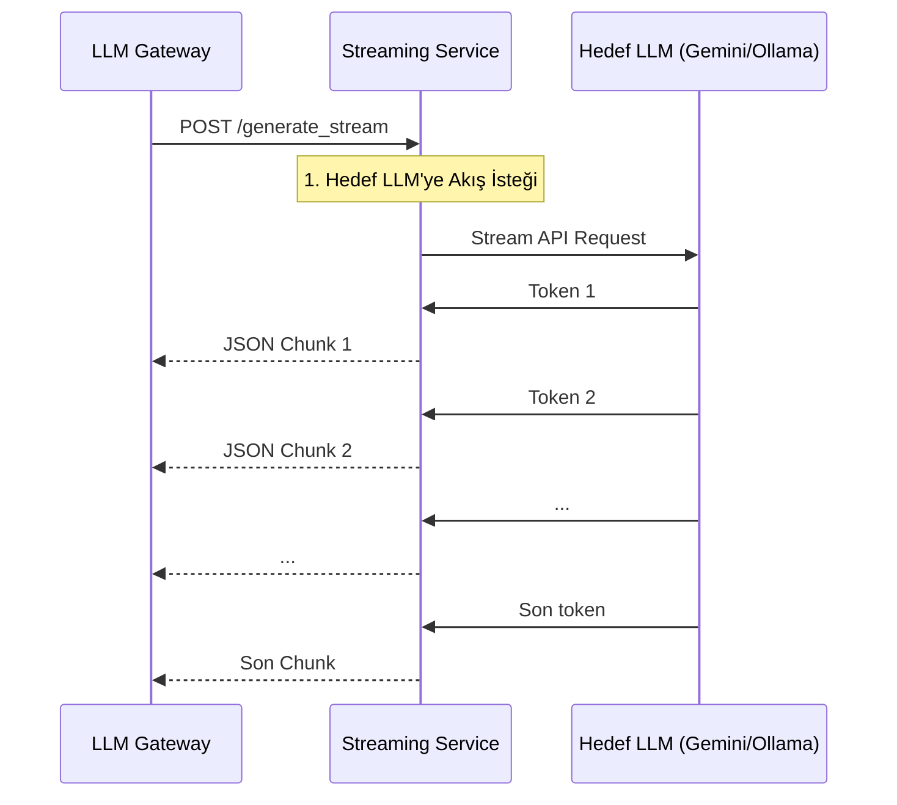

# ⚡ Sentiric LLM Streaming Service - Mantık ve Akış Mimarisi

**Stratejik Rol:** Büyük dil modellerinden gelen sonuçları parça parça, düşük gecikmeyle (low-latency) tüketen ana servise (Agent veya UI) aktarmak için tasarlanmış uzman akış motoru. Amacı, ilk tokenin gelme süresini (TTFT) en aza indirmektir.

---

## 1. Temel Akış: Akış Oluşturma (GenerateStream)

Bu servis, LLM Gateway'den gelen bir talep üzerine, hedef LLM sağlayıcısına (Gemini, Ollama) bağlanır ve gelen veri akışını olduğu gibi istemciye (LLM Gateway) geri yansıtır.

## 2. Optimizasyonlar
* Protokol Şeffaflığı: Mümkünse, hedef LLM'den gelen akışın formatını minimum işlemle (sadece JSON parsing) istemciye aktarır.
* Bağlantı Yönetimi: Yüksek sayıda eşzamanlı akış bağlantısını verimli bir şekilde yönetir.